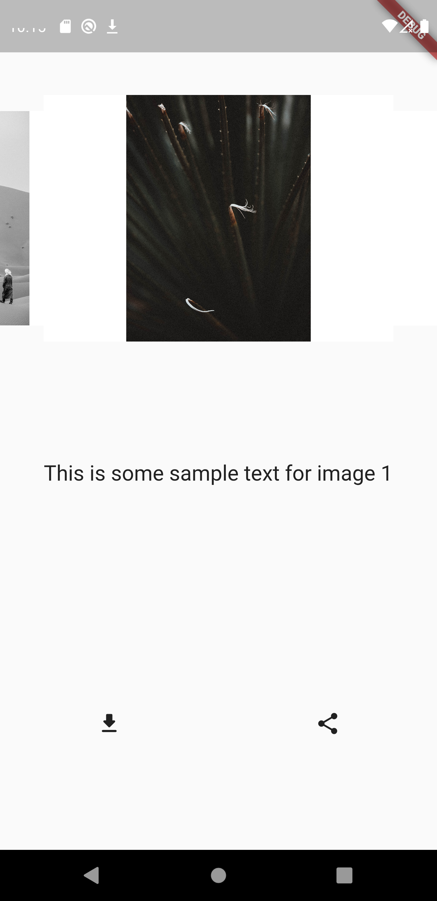

# Image Downloading and sharing app in Flutter

A Flutter project which allows user to browse through images on a server and download it or share it on social media.

## Flutter Plugins used :

1. [Carasoul Slider](https://pub.dev/packages/carousel_slider) : A flutter plugin used to implement the swpie navigation to browse through images on the server.
2. [Firebase core](https://pub.dev/packages/firebase_core) & [Cloud Firestore](https://pub.dev/packages/cloud_firestore) : A flutter plugin used to communicate and retrieve images from the Firebase server.
3. [Flutter Downloader](https://pub.dev/packages/flutter_downloader) : A flutter plugin used to download images from the Firebase server.
4. [Path Provider](https://pub.dev/packages/path_provider) : A flutter plugin used to get the path location where the image must be downloaded to.
5. [Permission Handler](https://pub.dev/packages/permission_handler) : A flutter plugin used to handle permissions for accessing local storage of a device.
6. [Share](https://pub.dev/packages/share) : A flutter plugin used to implement sharing functionality.
7. [Expandable Text](https://pub.dev/packages/expandable_text) : A flutter plugin used to display the text related to the image using and expandable text widget.
8. [Cached Network Image](https://pub.dev/packages/cached_network_image) : A flutter plugin used to display the image and also provide a Circular Progress Bar while the image is being retrieved from the database.

## Working of the code
1. The code base is basically divided into three files : `lib\main.dart` , `lib\HomePage.dart` and `lib\FireStoreHelper.dart`.
2. The `lib\main.dart` file calls the *MyApp* Class which in turn calls the *MyHomePage* class in the `lib\HomePage.dart`.
3. The `lib\HomePage.dart` file consists of all the widgets which when added together forms the basic UI of the application. It provides functions to implement **swipe navigation** to browse through images, **Downloading Images** and **Sharing the image link** features. It also consits of a expandable text box which consists of text related/describing the respective image.
5. The `lib\FireStoreHelper.dart` file consists of helper functions which helps the application to communicate with the Firebase (Server) to retrieve images and text.

## Running the code repository
### Prerequisite for running the code
1. Flutter support on the machine.
2. An Android/iOS Emulator on the machine.
	or
	An Android/iOS device with AVD features activated for USB Debugging.
3. VS Code / Xcode / Android Studio to run the main File.

### Steps to run the Code
1. Clone / Download the Code Repository
2. Open the Repository in VS Code / Xcode / Android Studio.
3. Navigate to lib/main.dart file
4. Run the lib/main.dart file on an Android/iOS Emulator or an Android/iOS device using USB Debugging.

### Screenshots

